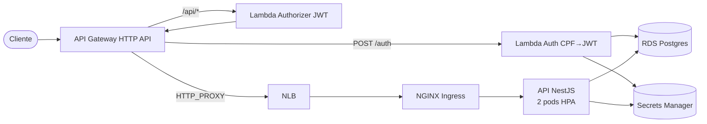

# fiap-fase3-app

> **Tech Challenge FIAP — Pós-graduação Software Architecture (14SOAT) — Fase 3**

API principal da Fase 3 do Tech Challenge: sistema de gestão de oficina mecânica em arquitetura cloud-native (AWS + Kubernetes + serverless + observabilidade).

[](https://github.com/arthurfcs98/fiap-fase3-app/actions/workflows/ci.yml)
[](https://github.com/arthurfcs98/fiap-fase3-app/actions/workflows/deploy.yml)
[](https://github.com/arthurfcs98/fiap-fase3-app/actions/workflows/gateway.yml)

## Endpoints de produção

| Ambiente | URL base |
|----------|---------|
| **prod** | `https://aopti5ygbj.execute-api.us-east-1.amazonaws.com/prod` |
| **homolog** | `https://aopti5ygbj.execute-api.us-east-1.amazonaws.com/homolog` |
| Swagger (público) | `{base}/api/docs` |

> Os endpoints só estão **temporariamente ativos** durante o blitz de avaliação. Foram derrubados via `terraform destroy` após a gravação para preservar o crédito do AWS Academy.

## Arquitetura

Visão completa em [docs/diagrams/componentes.md](docs/diagrams/componentes.md). Resumo:



## Repositórios da Fase 3

| Repo | Conteúdo |
|------|----------|
| **[fiap-fase3-app](https://github.com/arthurfcs98/fiap-fase3-app)** (este) | API NestJS, manifestos K8s, **docs centrais** (RFCs, ADRs, diagramas, Gateway TF) |
| [fiap-fase3-auth-lambda](https://github.com/arthurfcs98/fiap-fase3-auth-lambda) | Lambda de autenticação por CPF + JWT |
| [fiap-fase3-infra-k8s](https://github.com/arthurfcs98/fiap-fase3-infra-k8s) | Terraform: VPC + EKS + NGINX Ingress + VPCE |
| [fiap-fase3-infra-db](https://github.com/arthurfcs98/fiap-fase3-infra-db) | Terraform: RDS Postgres + Secrets Manager |

## Stack

| Categoria | Tech |
|-----------|------|
| Runtime | Node.js 20 |
| Framework | NestJS 10 + TypeScript |
| ORM | TypeORM |
| DB | RDS Postgres 16.6 (gerenciado) |
| Cache/Queue | Redis + BullMQ |
| Auth | JWT HS256 (emitido pela Lambda externa) |
| Observability | OpenTelemetry SDK + pino (JSON logs) + correlationId |
| Container | Docker → ECR |
| Orquestração | Amazon EKS v1.30 |
| Ingress | NGINX (Helm) + NLB |
| API Gateway | AWS API Gateway HTTP API + Lambda Authorizer |
| Secrets | AWS Secrets Manager (sync no CI/CD para K8s Secret) |
| IaC | Terraform 1.6+ |
| CI/CD | GitHub Actions |

## Estrutura

```
fiap-fase3-app/
├── docs/                       # RFCs, ADRs, diagramas (centralizadas aqui)
│   ├── rfcs/                   # 3 RFCs (cloud, auth, banco)
│   ├── adrs/                   # 7 ADRs
│   └── diagrams/               # Componentes, sequência, ER + DBML
├── src/                        # NestJS app
│   ├── modules/                # customer, vehicle, service, part, service-order, notification, auth
│   ├── observability/          # otel.ts, pino.config.ts, metrics.ts
│   ├── shared/
│   │   ├── observability/      # CorrelationIdInterceptor (AsyncLocalStorage)
│   │   └── secrets/            # load-secrets.ts (boot-time AWS SM loader)
│   └── scripts/
│       └── run-migrations.ts   # standalone para o Job K8s
├── test/                       # 364 testes Jest
├── k8s/                        # 7 manifestos: namespace, configmap, deployment, service, hpa, migration-job, ingress
├── lambda-authorizer/          # Lambda Authorizer JWT (TS + esbuild)
├── terraform/gateway/          # API Gateway HTTP API + integrations
├── scripts/sync-aws-creds.sh   # Rotação manual STS pros GH secrets
├── .github/workflows/          # ci.yml, deploy.yml, gateway.yml
└── Dockerfile
```

## API — Contratos

### Autenticação (público)

```bash
curl -X POST {base}/auth \
  -H 'content-type: application/json' \
  -d '{"cpf":"11144477735"}'

# 200 OK
# { "token": "eyJ...", "expiresIn": 3600, "customer": { "id": "uuid", "name": "..." } }
#
# 400 -> { "code": "A0001", "message": "INVALID_CPF" }
# 404 -> { "code": "A0002", "message": "CUSTOMER_NOT_FOUND" }
```

### Rotas protegidas (Bearer JWT obrigatório)

| Método | Path | Descrição |
|--------|------|-----------|
| GET | `/api/admin/customers` | Lista clientes paginado |
| POST | `/api/admin/customers` | Cria cliente |
| GET | `/api/admin/customers/:id` | Detalhe |
| GET | `/api/admin/vehicles` | Lista veículos |
| GET | `/api/admin/services` | Catálogo de serviços |
| GET | `/api/admin/parts` | Catálogo de peças |
| GET | `/api/admin/service-orders` | Lista OSs (com prioridade) |
| POST | `/api/admin/service-orders` | Cria OS |
| PATCH | `/api/admin/service-orders/:id/status` | Atualiza status |
| ... | ... | 28 endpoints total |

### Rotas públicas

| Método | Path | Descrição |
|--------|------|-----------|
| GET | `/api/health` | Liveness/readiness probe |
| GET | `/api/docs` | Swagger UI |

## Setup local

```bash
git clone https://github.com/arthurfcs98/fiap-fase3-app
cd fiap-fase3-app
npm ci --legacy-peer-deps

# Subir DB local
docker compose up -d postgres redis

# Configurar env
cp .env.example .env  # ajustar DB_HOST=localhost, DB_SSL=false

# Migrations
npm run migration:run

# Dev server
npm run start:dev
```

Acesso: http://localhost:3000/api/docs

## Deploy

CI/CD em `.github/workflows/deploy.yml`:
1. Lint + Test (364 testes) + Build
2. Login ECR
3. Docker build + push (`<account>.dkr.ecr.us-east-1.amazonaws.com/fiap-fase3-app:<sha>`)
4. Lê outputs do `infra-db/terraform.tfstate` no S3 → ARNs dos secrets
5. Cria K8s Secret `api-secret` com DB creds + JWT secret (CI consome SM via STS, pods não — `LabEksNodeRole` não tem permissão)
6. `kubectl apply` manifests + espera migration Job completar
7. `kubectl rollout status` deployment

## Observabilidade

- **Logs JSON** (pino): cada linha contém `correlationId`, `level`, `time`, `service`, etc. Redact automático de `authorization` e `cpf`.
- **Correlation ID propagation**: header `x-correlation-id` no inbound + AsyncLocalStorage acessível em todas as camadas. Mesmo cid aparece no log do API Gateway, Lambda Auth, Lambda Authorizer e API.
- **Métricas custom** (OTel):
  - `orders_created_total` (Counter)
  - `order_status_duration_seconds` (Histogram)
  - `notifications_sent_total` (Counter)
- **Auto-instrumentation** ativa pra Express, pg, HTTP outbound, DNS.
- **Backend pluggável**: configurar `OTEL_EXPORTER_OTLP_ENDPOINT` envia traces+metrics via OTLP HTTP. Sem isso, SDK fica idle (sem custo).

## Documentação arquitetural

- [RFC-01 — Escolha de Cloud](docs/rfcs/RFC-01-cloud-provider.md)
- [RFC-02 — Auth por CPF Serverless](docs/rfcs/RFC-02-auth-cpf-serverless.md)
- [RFC-03 — Escolha do Banco](docs/rfcs/RFC-03-database-choice.md)
- [ADRs](docs/adrs/) — 7 decisões arquiteturais (EKS, STS, multi-repo, HTTP API, NGINX, observability, Secrets Manager)
- [Diagramas](docs/diagrams/) — Componentes, sequência (auth + criação OS), ER + DBML
- **Justificativa formal do modelo relacional**: ver [docs/diagrams/er.md](docs/diagrams/er.md)

## Autor

**Arthur Freitas Cesarino dos Santos** — RM369347
Pós-graduação Software Architecture FIAP — 14SOAT
