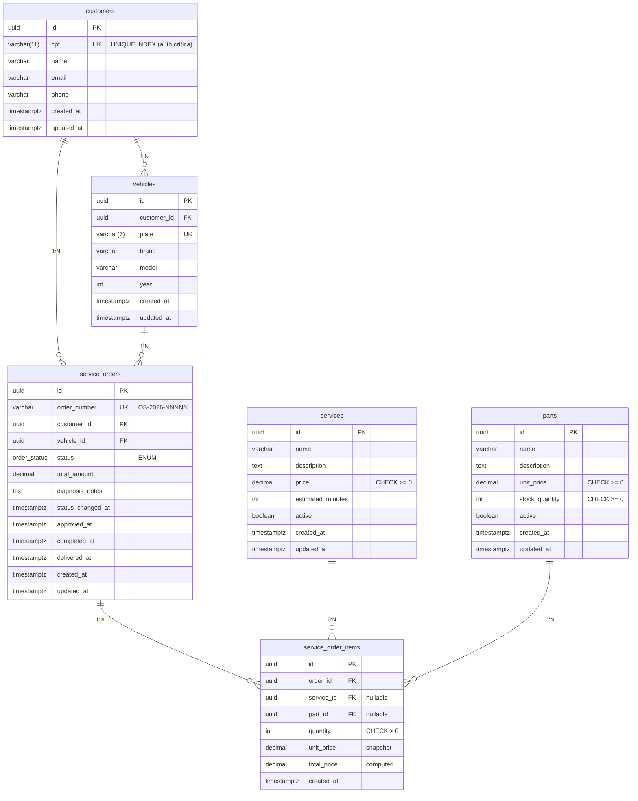

# Diagrama Entidade-Relacionamento (ER)

Modelo de dados relacional da aplicação, em PostgreSQL gerenciado (RDS).

## Visão geral



## Tabelas e relacionamentos

### `customers` — Clientes da oficina

| Coluna | Tipo | Constraints | Notas |
|--------|------|-------------|-------|
| id | uuid | PK, default `gen_random_uuid()` | |
| cpf | varchar(11) | NOT NULL, **UNIQUE** | índice único — auth depende de busca por CPF |
| name | varchar(255) | NOT NULL | |
| email | varchar(255) | | |
| phone | varchar(20) | | |
| created_at | timestamptz | NOT NULL, default now() | |
| updated_at | timestamptz | NOT NULL, default now() | |

**Relacionamentos:**
- 1:N com `vehicles` (um cliente pode ter vários veículos)
- 1:N com `service_orders` (um cliente pode ter várias ordens)

### `vehicles` — Veículos por cliente

| Coluna | Tipo | Constraints |
|--------|------|-------------|
| id | uuid | PK |
| customer_id | uuid | FK → customers, NOT NULL |
| plate | varchar(7) | NOT NULL, UNIQUE |
| brand | varchar(100) | NOT NULL |
| model | varchar(100) | NOT NULL |
| year | int | CHECK (year BETWEEN 1900 AND 2100) |
| created_at | timestamptz | NOT NULL, default now() |
| updated_at | timestamptz | NOT NULL, default now() |

### `services` — Catálogo de serviços

| Coluna | Tipo | Constraints |
|--------|------|-------------|
| id | uuid | PK |
| name | varchar(255) | NOT NULL |
| description | text | |
| price | numeric(10,2) | NOT NULL, CHECK (price >= 0) |
| estimated_minutes | int | CHECK (estimated_minutes > 0) |
| active | boolean | default true |
| created_at | timestamptz | default now() |
| updated_at | timestamptz | default now() |

### `parts` — Catálogo de peças com estoque

| Coluna | Tipo | Constraints |
|--------|------|-------------|
| id | uuid | PK |
| name | varchar(255) | NOT NULL |
| description | text | |
| unit_price | numeric(10,2) | NOT NULL, CHECK (unit_price >= 0) |
| stock_quantity | int | NOT NULL, CHECK (stock_quantity >= 0) |
| active | boolean | default true |
| created_at | timestamptz | default now() |
| updated_at | timestamptz | default now() |

### `service_orders` — Ordens de serviço (entidade central)

| Coluna | Tipo | Constraints |
|--------|------|-------------|
| id | uuid | PK |
| order_number | varchar(20) | NOT NULL, UNIQUE, formato `OS-2026-NNNNN` |
| customer_id | uuid | FK → customers, NOT NULL |
| vehicle_id | uuid | FK → vehicles, NOT NULL |
| status | order_status (enum) | NOT NULL, default `RECEIVED` |
| total_amount | numeric(10,2) | NOT NULL, default 0 |
| diagnosis_notes | text | |
| status_changed_at | timestamptz | NOT NULL |
| approved_at | timestamptz | |
| completed_at | timestamptz | |
| delivered_at | timestamptz | |
| created_at | timestamptz | default now() |
| updated_at | timestamptz | default now() |

**Enum `order_status`:**
```sql
CREATE TYPE order_status AS ENUM (
  'RECEIVED',
  'IN_DIAGNOSIS',
  'AWAITING_APPROVAL',
  'AWAITING_START',
  'IN_PROGRESS',
  'COMPLETED',
  'DELIVERED',
  'CANCELLED'
);
```

**Índices:**
- `customer_id, status` — listagem por cliente filtrada
- `status, created_at DESC` — listagem por prioridade (operadores)

### `service_order_items` — Itens da ordem (serviços e/ou peças)

| Coluna | Tipo | Constraints |
|--------|------|-------------|
| id | uuid | PK |
| order_id | uuid | FK → service_orders, NOT NULL |
| service_id | uuid | FK → services, nullable |
| part_id | uuid | FK → parts, nullable |
| quantity | int | NOT NULL, CHECK (quantity > 0) |
| unit_price | numeric(10,2) | NOT NULL (snapshot do preço na criação) |
| total_price | numeric(10,2) | computed/stored |
| created_at | timestamptz | default now() |

**Check constraint:** `service_id IS NOT NULL OR part_id IS NOT NULL` (item é serviço OU peça, nunca ambos vazios).

## Justificativa formal do modelo (exigência do enunciado)

### Por que UUID em vez de bigint sequencial?

- **IDs geráveis na aplicação** (`gen_random_uuid()` no Postgres ou client-side) — útil para escrita idempotente, retries seguros, e geração antes do INSERT
- **Não vaza cardinalidade** (não dá pra inferir "quantos clientes existem" a partir do ID)
- **Distributed-friendly** — em cenário multi-region eventual, evita conflitos de chave
- **Trade-off aceito:** 16 bytes vs 8 do bigint; índices ligeiramente maiores. Irrelevante na escala do projeto

### Por que enum no banco para `order_status`?

- **Integridade no nível do banco:** valores fora da lista são rejeitados pelo SGBD, não dependendo da aplicação
- **Indexação eficiente:** Postgres indexa enums como int4 internamente
- **Trade-off aceito:** alterar enum exige migration explícita (`ALTER TYPE ... ADD VALUE`); a contrapartida (CHECK constraint sobre `varchar`) é equivalente em garantias mas menos legível

### Por que separar `service_order_items` (em vez de JSON na ordem)?

- **Queries analíticas viáveis:** `SELECT SUM(quantity)` por serviço/peça, top services, etc.
- **Foreign keys explícitas:** integridade referencial garantida; deletar uma `part` referenciada falha (ou cascateia, dependendo da política)
- **Índices granulares:** lookup por `service_id` direto
- **Trade-off:** mais joins em queries de leitura; mitigado por eager loading via TypeORM

### Por que snapshot de preço (`unit_price` em items)?

- **Auditabilidade:** se serviço aumenta de preço amanhã, ordens antigas mantêm preço cobrado na criação
- **Sem dependência temporal:** total da OS é determinístico mesmo se catálogo muda
- **Trade-off:** duplicação aparente (preço também está em `services.price`); intencional

### Por que campos de timestamp por status (`approved_at`, `completed_at`, etc.) em vez de tabela de histórico?

- **Acesso direto:** queries de SLA (tempo entre `created_at` e `approved_at`) são triviais
- **Suficiência:** o domínio só precisa de UM momento por status (não múltiplas transições back-and-forth)
- **Trade-off:** se virar requisito auditar mudanças de status repetidas, vira tabela `service_order_status_log`. Hoje não é o caso

### Mudanças do modelo da Fase 2 → Fase 3

Mínimas. O modelo da Fase 2 já é adequado:

1. **Drop da tabela `users`** — Fase 3 não tem login user/senha; usuários operadores futuros ficarão fora de escopo
2. **`customers.cpf` ganha index UNIQUE** — auth depende disso ser rápido + único
3. **Nenhuma migration breaking** — schema é evolução aditiva

## Volumes estimados (projeto acadêmico)

| Tabela | Linhas esperadas | Crescimento |
|--------|-----------------|-------------|
| customers | < 100 | manual via seed |
| vehicles | < 200 | manual |
| services | < 50 | manual |
| parts | < 200 | manual |
| service_orders | < 1.000 (após demo) | demo + smoke tests |
| service_order_items | < 5.000 | derivado |

Storage estimado: < 100 MB.
RDS `db.t3.micro` com gp2 20GB tem folga de 200×.

## DBML (para dbdiagram.io)

```dbml
Table customers {
  id uuid [pk, default: `gen_random_uuid()`]
  cpf varchar(11) [unique, not null]
  name varchar(255) [not null]
  email varchar(255)
  phone varchar(20)
  created_at timestamptz [default: `now()`]
  updated_at timestamptz [default: `now()`]
  Indexes {
    cpf [unique]
  }
}

Table vehicles {
  id uuid [pk]
  customer_id uuid [ref: > customers.id, not null]
  plate varchar(7) [unique, not null]
  brand varchar(100) [not null]
  model varchar(100) [not null]
  year int
  created_at timestamptz
  updated_at timestamptz
}

Table services {
  id uuid [pk]
  name varchar(255) [not null]
  description text
  price decimal [not null]
  estimated_minutes int
  active boolean [default: true]
  created_at timestamptz
  updated_at timestamptz
}

Table parts {
  id uuid [pk]
  name varchar(255) [not null]
  description text
  unit_price decimal [not null]
  stock_quantity int [not null]
  active boolean [default: true]
  created_at timestamptz
  updated_at timestamptz
}

enum order_status {
  RECEIVED
  IN_DIAGNOSIS
  AWAITING_APPROVAL
  AWAITING_START
  IN_PROGRESS
  COMPLETED
  DELIVERED
  CANCELLED
}

Table service_orders {
  id uuid [pk]
  order_number varchar(20) [unique, not null]
  customer_id uuid [ref: > customers.id, not null]
  vehicle_id uuid [ref: > vehicles.id, not null]
  status order_status [not null, default: 'RECEIVED']
  total_amount decimal [default: 0]
  diagnosis_notes text
  status_changed_at timestamptz [not null]
  approved_at timestamptz
  completed_at timestamptz
  delivered_at timestamptz
  created_at timestamptz
  updated_at timestamptz
  Indexes {
    (customer_id, status)
    (status, created_at)
  }
}

Table service_order_items {
  id uuid [pk]
  order_id uuid [ref: > service_orders.id, not null]
  service_id uuid [ref: > services.id]
  part_id uuid [ref: > parts.id]
  quantity int [not null]
  unit_price decimal [not null]
  total_price decimal
  created_at timestamptz
}
```

Para gerar visualização: copiar este bloco DBML em https://dbdiagram.io e exportar PNG para `er.png` neste diretório.
