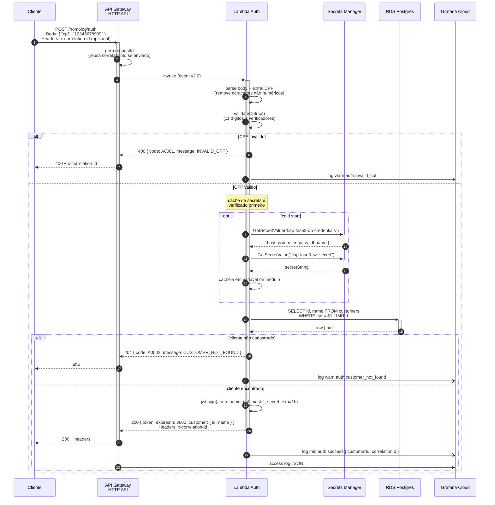

# Diagrama de Sequência — Autenticação por CPF

Fluxo completo desde o cliente enviando o CPF até receber o JWT.

## Diagrama



## Detalhes

### Códigos de erro

| Status | Code | Message | Causa |
|--------|------|---------|-------|
| 400 | A0001 | INVALID_CPF | CPF não tem 11 dígitos OU falha nos verificadores OU é sequência repetida |
| 404 | A0002 | CUSTOMER_NOT_FOUND | CPF válido mas não existe na tabela `customers` |
| 500 | X0001 | INTERNAL_ERROR | Falha em SM/RDS/parsing JSON |

### Payload do JWT

```json
{
  "sub": "8c5f3e2a-1234-4abc-9def-0123456789ab",
  "name": "Arthur Cesarino",
  "cpf": "123*****909",
  "iat": 1748160000,
  "exp": 1748163600
}
```

- `sub` = customer ID (UUID)
- `cpf` mascarado nos claims pra reduzir vazamento em logs

### Headers de tracing

- Cliente pode enviar `x-correlation-id` na primeira chamada (UUID que ele já tem)
- Se não enviar, Gateway gera `requestId` e Lambda usa esse mesmo valor
- Lambda **devolve** `x-correlation-id` no response — cliente pode reutilizar nas próximas chamadas
- Mesmo valor aparece nos logs do Gateway, Lambda, e (depois) da API e do Authorizer

### Cache de secrets (otimização cold start)

```typescript
// scoped at module level (sobrevive entre invocações no mesmo container)
let cachedSecrets: { db: {...}, jwtSecret: string } | null = null;
let cachedRepo: CustomerRepo | null = null;
```

- Primeira invocação ("cold start"): ~1.5-3s (incluindo VPC ENI + SM calls + pool Postgres)
- Invocações subsequentes ("warm"): ~50-150ms (só `SELECT` no DB + assinatura JWT)
- Lambda em VPC mantém warm container por ~5-15min de inatividade antes de reciclar

### Logs JSON gerados

```json
{"level":"info","time":"2026-06-01T10:00:01.234Z","service":"auth-lambda","correlationId":"7a3f-...","msg":"auth.start"}
{"level":"info","time":"2026-06-01T10:00:01.523Z","service":"auth-lambda","correlationId":"7a3f-...","customerId":"8c5f-...","msg":"auth.success"}
```
