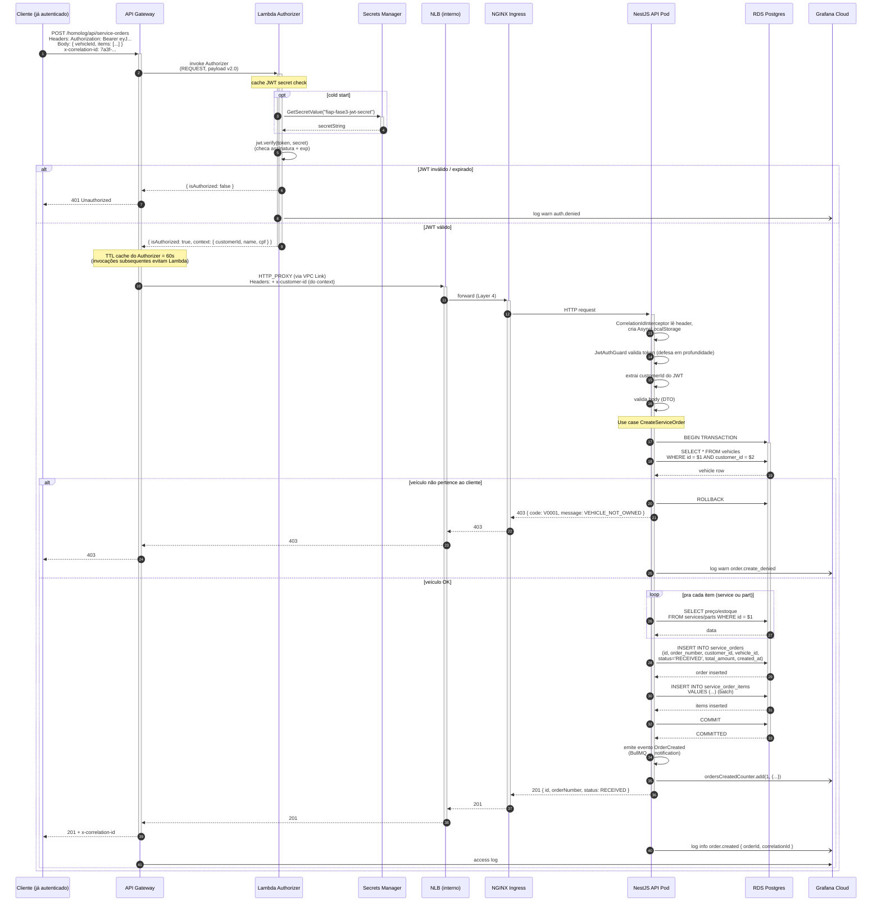

# Diagrama de Sequência — Criação de Ordem de Serviço

Fluxo de uma chamada autenticada que cria uma Ordem de Serviço, atravessando todos os componentes do sistema.

## Diagrama

## Observações de design

### Defesa em profundidade na autenticação
1. **Lambda Authorizer** valida JWT no Gateway (curto, em segundos)
2. **JwtAuthGuard** valida o mesmo JWT no Nest (defesa contra bypass do Gateway via `kubectl port-forward`)
3. Ambos consultam o **mesmo segredo** no Secrets Manager

### Cache do Authorizer
- Configurado com `authorizer_result_ttl_in_seconds = 60`
- Invocações subsequentes pro mesmo token nos 60s seguintes pulam a Lambda Authorizer
- Economiza ~50ms e ~10 Lambda invocações/sessão típica
- Trade-off: revogação de token tem latência até 60s (aceitável)

### Propagação de correlation ID
- Cliente envia ou Gateway gera no auth inicial
- Authorizer **não modifica** (só lê pra log)
- Gateway repassa para o NLB via header
- NestJS `CorrelationIdInterceptor` extrai e popula `AsyncLocalStorage`
- Todos os logs do request (Authorizer, Gateway, API, queries DB via custom logger) carregam o mesmo cid
- Cliente recebe de volta no `x-correlation-id` response

### Métricas custom
- `recordCustomEvent("ServiceOrderCreated", { ... })` envia evento ao New Relic
- Usado pra dashboards: "Volume diário de OS" via NRQL `SELECT count(*) FROM ServiceOrderCreated TIMESERIES`

### Atomicidade da criação
- Toda inserção (ordem + itens) em uma transação Postgres
- Falha em qualquer passo → ROLLBACK; cliente recebe erro estruturado
- `BullMQ` evento só é emitido após COMMIT bem-sucedido

## Variação: mudança de status

A mudança de status (`PATCH /api/service-orders/:id/status`) segue fluxo similar, mas:
- Acessa `service_orders` por id + valida ownership do cliente
- Aplica máquina de estados (`RECEIVED → IN_DIAGNOSIS → AWAITING_APPROVAL → ...`)
- Emite `recordCustomEvent("ServiceOrderStatusChanged", { fromStatus, toStatus, durationMs })`
- Métrica feed dashboard "Tempo médio por status"
